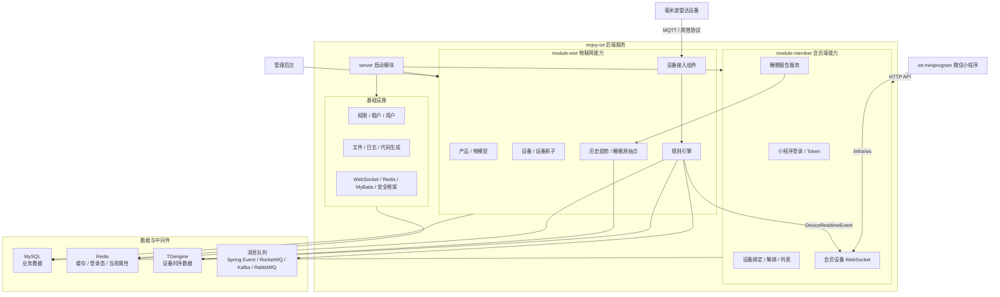

# 智联未来 IoT 后端服务

## 项目简介

智联未来 IoT 后端服务是面向智能养老与毫米波雷达设备场景的物联网数据平台，负责承接设备接入、物模型管理、设备状态维护、历史数据沉淀、会员端设备绑定、实时数据推送与睡眠健康报告分析。

本项目基于 `Spring Boot` 多模块架构构建，对上为管理后台和微信小程序提供 HTTP API 与 WebSocket 实时通道，对下通过 EIOT 设备接入组件、规则引擎和时序数据服务处理设备上报数据。它与 `iot-miniprogram` 小程序共同组成用户侧设备接入、云端绑定、实时监测和睡眠报告查看的完整链路。

> 注意：仓库不提交任何真实 `*.yaml` / `*.yml` 配置文件。启动项、数据库、Redis、消息队列、时序数据库、第三方密钥等配置需要在本地或部署环境中自行创建。

## 核心功能

- 设备接入：支持 MQTT、HTTP、TCP、UDP、Modbus、CoAP 等多种设备接入组件。
- 产品与物模型：管理产品、品类、设备物模型、属性、服务、事件和设备配置。
- 设备管理：支持设备注册、分组、标签、上下线状态、设备影子、远程控制和历史数据查询。
- 规则引擎：消费设备物模型消息，完成属性入库、状态变更、告警联动和实时事件发布。
- 会员端设备能力：为小程序提供设备绑定、解绑、绑定设备列表、设备详情和属性趋势接口。
- 实时监测：通过 WebSocket 向已登录且已绑定设备的会员推送设备快照、属性变更和在线状态。
- 睡眠报告：基于雷达设备历史属性点识别睡眠片段，生成最新睡眠报告和最近 30 天报告列表。
- 历史趋势：按时间范围和物模型数值属性聚合设备历史数据，用于小程序趋势图展示。
- 后台基础能力：集成权限、租户、用户、文件、日志、字典、代码生成、接口文档等基础模块。

## 系统架构



## 小程序接口能力

后端为 `iot-miniprogram` 提供会员端 API 和实时数据通道：

- `/member/auth/weixin-mini-login`：微信小程序登录。
- `/member/auth/refresh-token`：刷新登录 Token。
- `/member/auth/logout`：退出登录。
- `/member/user/get`：获取当前会员用户信息。
- `/member/user/update-avatar`：上传并更新用户头像。
- `/member/device/bind`：通过 `productKey + dn` 绑定设备到当前会员。
- `/member/device/unbind`：解绑当前会员名下设备。
- `/member/device/list`：获取当前会员已绑定设备 ID 列表。
- `/member/device/detail-list`：获取当前会员已绑定设备详情列表。
- `/member/device/property-trend`：查询设备属性历史趋势。
- `/member/device/sleep-report/latest`：获取最新睡眠报告。
- `/member/device/sleep-report/list`：获取最近睡眠报告列表。
- `/infra/ws`：小程序设备实时监测 WebSocket 通道。

WebSocket 设备监测消息类型：

- `member-device-monitor-subscribe`：订阅单台设备实时属性。
- `member-device-monitor-unsubscribe`：取消订阅单台设备。
- `member-device-status-subscribe`：订阅当前会员绑定设备的在线状态。
- `member-device-status-unsubscribe`：取消设备在线状态订阅。
- `member-device-monitor-ack`：订阅确认。
- `member-device-monitor-error`：订阅错误。
- `member-device-monitor-snapshot`：当前属性快照。
- `member-device-monitor-property`：实时属性变化。
- `member-device-monitor-status`：设备在线状态变化。

## 实时数据链路

1. 设备通过 MQTT 或其他接入组件上报物模型属性消息。
2. 规则引擎 `DevicePropertyHandler` 消费属性消息，按物模型过滤并规范化属性值。
3. 后端更新 Redis 中的设备当前属性缓存，并将属性记录写入时序数据服务。
4. 规则引擎发布 `DeviceRealtimeEvent`，携带设备 ID、`productKey`、`dn`、属性值和发生时间。
5. `module-member` 的 WebSocket 服务检查会员登录态和设备绑定关系。
6. 已订阅该设备的小程序会收到属性快照、实时属性变更和在线状态消息。

设备上下线由 `DeviceStateCheckHandler` 处理，状态变化同样会发布 `DeviceRealtimeEvent`，再推送到会员端 WebSocket。

## 睡眠报告链路

睡眠报告不是静态表查询，而是基于雷达设备历史属性点生成：

1. 小程序请求最新报告或最近报告列表。
2. 后端校验当前会员是否绑定目标设备。
3. `DeviceHistoryApi` 从时序数据中读取睡眠相关历史点。
4. `MemberDeviceSleepReportService` 按时间窗口识别睡眠 session。
5. 后端聚合睡眠评分、总睡眠、深睡、浅睡、REM、清醒、离床、入睡耗时、醒来次数、平均心率、平均呼吸、呼吸暂停、体动比例等指标。
6. 小程序展示睡眠概览、报告列表和报告详情。

当前睡眠报告使用的关键历史字段包括：

- `algorithmState`
- `sleepProgress`
- `avgHeartRate`
- `avgBreathingRate`
- `apneaCount`
- `largeMoveRatio`
- `smallMoveRatio`
- `algoTotalSleepTime`
- `algoDeepSleepTime`
- `algoLightSleepTime`
- `algoRemSleepTime`
- `algoAwakeTime`
- `algoOutOfBedTime`
- `algoSleepLatency`
- `algoWakeCount`
- `algoSleepCycles`
- `algoTotalScore`

## 模块结构

```text
.
├─ server                 # Spring Boot 启动入口，聚合业务模块与设备接入组件
├─ module-eiot            # IoT 核心模块：产品、设备、物模型、规则引擎、时序数据、接入组件
├─ module-member          # 会员端模块：小程序登录、用户设备绑定、睡眠报告、实时监测 WebSocket
├─ module-system          # 系统管理模块：用户、角色、权限、租户、字典等
├─ module-infra           # 基础设施模块：文件、日志、代码生成、WebSocket 发送能力等
├─ module-ai              # AI 扩展模块
├─ framework              # 通用 Spring Boot starter 和基础封装
├─ dependencies           # Maven 依赖版本统一管理
├─ docs                   # 项目文档
├─ _sql                   # 数据库初始化脚本
└─ _script                # 脚本与容器相关文件
```

## 技术栈

- Java 21
- Spring Boot 3.4.1
- Maven 多模块工程
- MyBatis Plus / MyBatis Plus Join / Dynamic Datasource
- MySQL
- Redis / Redisson
- TDengine 时序数据库
- Spring WebSocket
- Spring Event / RocketMQ / Kafka / RabbitMQ
- Knife4j / SpringDoc OpenAPI
- Lombok / MapStruct
- Vert.x IoT 接入组件

## 数据存储

- MySQL：业务数据、系统配置、用户、租户、产品、设备、设备绑定关系。
- Redis：登录态、缓存、设备当前属性、WebSocket 辅助状态。
- TDengine：设备属性历史数据、趋势查询数据、睡眠报告原始点。
- 消息队列：可按部署需要选择 Spring Event、RocketMQ、Kafka、RabbitMQ 等消息通道。

## 与小程序的关系

`iot-miniprogram` 是用户侧入口，负责微信登录、BLE 设备发现、WiFi 配网、设备切换、实时监测和睡眠报告展示。

`enjoy-iot` 是云端能力中心，负责设备云端身份、会员绑定关系、历史数据查询、睡眠报告分析和 WebSocket 实时推送。小程序通过 HTTP 获取账号、设备和报告数据，通过 `/infra/ws` 订阅实时属性和在线状态，通过 BLE 完成本地设备连接与配网。

## 配置说明

为了避免敏感信息泄露，仓库不提交任何 `*.yaml` / `*.yml` 配置文件。运行项需要在本地或部署环境中自行提供，至少包括：

- Spring Boot 主配置
- `eiot` profile 配置
- MySQL 数据源
- Redis 地址
- TDengine 或其他时序数据源
- WebSocket 配置
- 微信小程序 appid / secret
- 消息队列配置

## 许可证

本项目基于 Apache License 2.0 协议开源。使用、修改和分发时请遵守仓库内 `LICENSE` 文件中的协议约束。
