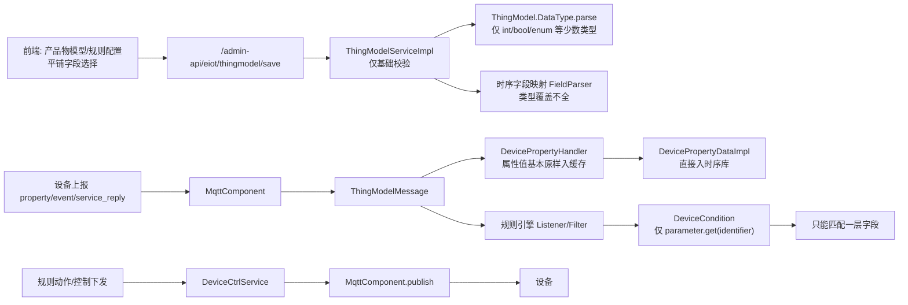
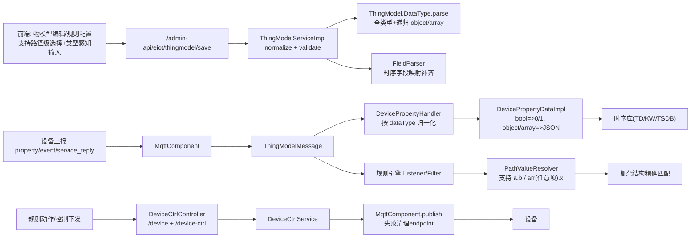

# 满血物模型：老链路 vs 新链路（图示 + 全量样例）

> 日期：2026-04-23  
> 范围：`enjoy-iot` + `enjoy-web` 当前 `feature/fullblood-thing-model` 分支

---

## 1. 目标

本文用于：
1. 用图展示**老物模型链路**和**新物模型链路**；
2. 给出一个可直接复用的**全数据结构样例**（覆盖 `bool/enum/int32/int64/float/double/string/text/date/datetime/position/object/array`，含嵌套）。

---

## 2. 老物模型链路（改造前）

### 2.1 总览图



### 2.2 老链路典型限制

- **数据类型覆盖不全**：`ThingModel.DataType.parse` 早期主要处理 `int/bool/enum`。
- **复杂结构能力弱**：规则条件对 `object/array` 只能按整体字符串比较，缺少路径级匹配。
- **布尔值落库风险**：时序层可能遇到 `true/false` 与 `TINYINT(0/1)`不一致问题。
- **前端规则配置可读性不足**：复杂字段缺少路径展开选择和类型感知输入。

---

## 3. 新物模型链路（满血版）

### 3.1 总览图



### 3.2 关键增强点（对应代码）

- **全类型解析与递归解析**  
  `module-eiot/module-eiot-api/.../ThingModel.java`
- **物模型保存前规范化与强校验**  
  `module-eiot/module-eiot-biz/.../ThingModelServiceImpl.java`
- **规则路径解析（含数组通配）**  
  `module-eiot/module-eiot-core/iot-rule-engine/.../PathValueResolver.java`  
  `.../listener/DeviceCondition.java`  
  `.../filter/DeviceCondition.java`
- **属性归一化落库（bool、object、array）**  
  `module-eiot/module-eiot-core/iot-rule-engine/.../DevicePropertyHandler.java`  
  `module-eiot/module-eiot-temporal/.../DevicePropertyDataImpl.java`
- **前端规则配置器升级（路径级 + 类型输入）**  
  `enjoy-web/src/views/eiot/ruleinfo/modules/listener.vue`  
  `enjoy-web/src/views/eiot/ruleinfo/modules/filtera.vue`

---

## 4. 老 vs 新：差异对照

| 维度 | 老链路 | 新链路（满血） |
|---|---|---|
| 数据类型 | 部分基础类型 | 全类型：`bool/enum/int32/int64/float/double/string/text/date/datetime/position/object/array` |
| 复杂结构 | 基本按整体值处理 | `object/array` 递归解析 + 路径级访问 |
| 规则过滤 | 一层字段为主 | 支持 `a.b.c`、`arr[*].x` |
| 布尔一致性 | 可能 `true/false` 直接入库 | 统一归一到 `0/1` |
| 前端规则配置 | 平铺选择，弱类型输入 | Cascader 路径选择 + 类型感知控件 |
| 下行稳定性 | 连接异常恢复较弱 | 下发异常时清理 endpoint，链路更稳 |

---

## 5. 覆盖所有数据结构的样例

> 该样例可用于：产品物模型定义、模拟上报、规则匹配、服务调用回包、下行联调。

### 5.0 链路统一消息封装（`ThingModelMessage`）

> 说明：设备侧 payload（如 property/report）会被上层链路封装成统一结构，供规则、缓存、时序、ES 等模块消费。

```json
{
  "id": "server-msg-id-001",
  "mid": "device-mid-001",
  "deviceId": 10001,
  "productKey": "FULLBLOOD_DEMO_V1",
  "dn": "SN-001",
  "uid": "U10086",
  "type": "property",
  "identifier": "report",
  "code": 0,
  "data": {
    "p_bool": 1,
    "p_enum": "2",
    "p_object": { "sub_obj": { "city": "Shanghai" } },
    "p_array": [ { "k": "A", "v": 10.5, "flags": [1, 0, 1] } ]
  },
  "occurred": 1776929304547,
  "time": 1776929304550,
  "toClient": false
}
```

### 5.1 物模型定义（核心片段）

```json
{
  "productKey": "FULLBLOOD_DEMO_V1",
  "model": {
    "properties": [
      { "identifier": "p_bool", "name": "布尔量", "dataType": { "type": "bool", "specs": { "0": "关", "1": "开" } } },
      { "identifier": "p_enum", "name": "枚举量", "dataType": { "type": "enum", "specs": { "0": "待机", "1": "运行", "2": "故障" } } },
      { "identifier": "p_int32", "name": "32位整数", "dataType": { "type": "int32", "specs": { "min": "-100", "max": "100" } } },
      { "identifier": "p_int64", "name": "64位整数", "dataType": { "type": "int64", "specs": { "min": "0", "max": "9223372036854775807" } } },
      { "identifier": "p_float", "name": "单精度", "dataType": { "type": "float", "specs": { "min": "-1000", "max": "1000" } } },
      { "identifier": "p_double", "name": "双精度", "dataType": { "type": "double", "specs": { "min": "-100000", "max": "100000" } } },
      { "identifier": "p_string", "name": "短字符串", "dataType": { "type": "string", "specs": { "length": 64 } } },
      { "identifier": "p_text", "name": "长文本", "dataType": { "type": "text", "specs": { "length": 1024 } } },
      { "identifier": "p_date", "name": "日期", "dataType": { "type": "date" } },
      { "identifier": "p_datetime", "name": "日期时间", "dataType": { "type": "datetime" } },
      { "identifier": "p_position", "name": "位置", "dataType": { "type": "position", "specs": { "locateType": "lonLat" } } },
      {
        "identifier": "p_object",
        "name": "对象结构",
        "dataType": {
          "type": "object",
          "specs": {
            "properties": [
              { "identifier": "sub_bool", "name": "子布尔", "dataType": { "type": "bool", "specs": { "0": "否", "1": "是" } } },
              { "identifier": "sub_enum", "name": "子枚举", "dataType": { "type": "enum", "specs": { "A": "甲", "B": "乙" } } },
              { "identifier": "sub_int", "name": "子整型", "dataType": { "type": "int32", "specs": { "min": "0", "max": "9999" } } },
              {
                "identifier": "sub_obj",
                "name": "子对象",
                "dataType": {
                  "type": "object",
                  "specs": {
                    "properties": [
                      { "identifier": "city", "name": "城市", "dataType": { "type": "string", "specs": { "length": 32 } } },
                      { "identifier": "ts", "name": "时间戳", "dataType": { "type": "datetime" } }
                    ]
                  }
                }
              }
            ]
          }
        }
      },
      {
        "identifier": "p_array",
        "name": "数组结构",
        "dataType": {
          "type": "array",
          "specs": {
            "itemType": {
              "type": "object",
              "specs": {
                "properties": [
                  { "identifier": "k", "name": "键", "dataType": { "type": "string", "specs": { "length": 16 } } },
                  { "identifier": "v", "name": "值", "dataType": { "type": "double", "specs": { "min": "-9999", "max": "9999" } } },
                  { "identifier": "flags", "name": "标记数组", "dataType": { "type": "array", "specs": { "itemType": { "type": "int32" } } } }
                ]
              }
            }
          }
        }
      }
    ],
    "events": [
      {
        "identifier": "alarm",
        "name": "告警事件",
        "outputData": [
          { "identifier": "level", "name": "等级", "dataType": { "type": "enum", "specs": { "1": "一级", "2": "二级", "3": "三级" } } },
          { "identifier": "code", "name": "编码", "dataType": { "type": "int32", "specs": { "min": "0", "max": "99999" } } },
          {
            "identifier": "detail",
            "name": "详情",
            "dataType": {
              "type": "object",
              "specs": {
                "properties": [
                  { "identifier": "msg", "name": "消息", "dataType": { "type": "text", "specs": { "length": 256 } } },
                  { "identifier": "snapshot", "name": "快照", "dataType": { "type": "array", "specs": { "itemType": { "type": "double" } } } }
                ]
              }
            }
          }
        ]
      }
    ],
    "services": [
      {
        "identifier": "calibrate",
        "name": "校准",
        "inputData": [
          { "identifier": "target", "name": "目标值", "dataType": { "type": "double", "specs": { "min": "-1000", "max": "1000" } } },
          {
            "identifier": "profile",
            "name": "策略",
            "dataType": {
              "type": "object",
              "specs": {
                "properties": [
                  { "identifier": "mode", "name": "模式", "dataType": { "type": "enum", "specs": { "0": "快速", "1": "精确" } } },
                  { "identifier": "window", "name": "窗口", "dataType": { "type": "array", "specs": { "itemType": { "type": "int32" } } } }
                ]
              }
            }
          }
        ],
        "outputData": [
          { "identifier": "ok", "name": "是否成功", "dataType": { "type": "bool", "specs": { "0": "失败", "1": "成功" } } },
          { "identifier": "at", "name": "完成时间", "dataType": { "type": "datetime" } },
          {
            "identifier": "result",
            "name": "结果对象",
            "dataType": {
              "type": "object",
              "specs": {
                "properties": [
                  { "identifier": "before", "name": "校准前", "dataType": { "type": "double" } },
                  { "identifier": "after", "name": "校准后", "dataType": { "type": "double" } }
                ]
              }
            }
          }
        ]
      }
    ]
  }
}
```

### 5.2 属性上报（property/report）

```json
{
  "type": "property",
  "identifier": "report",
  "data": {
    "p_bool": 1,
    "p_enum": "2",
    "p_int32": 88,
    "p_int64": 1234567890123,
    "p_float": 12.34,
    "p_double": 12345.6789,
    "p_string": "SN-001",
    "p_text": "fullblood payload text",
    "p_date": "2026-04-23",
    "p_datetime": "2026-04-23 15:30:00",
    "p_position": "121.4737,31.2304",
    "p_object": {
      "sub_bool": 0,
      "sub_enum": "A",
      "sub_int": 9527,
      "sub_obj": {
        "city": "Shanghai",
        "ts": "2026-04-23 15:30:00"
      }
    },
    "p_array": [
      { "k": "A", "v": 10.5, "flags": [1, 0, 1] },
      { "k": "B", "v": -2.75, "flags": [0, 0, 1] }
    ]
  }
}
```

### 5.3 事件上报（event/alarm）

```json
{
  "type": "event",
  "identifier": "alarm",
  "data": {
    "level": "2",
    "code": 31002,
    "detail": {
      "msg": "temperature out of range",
      "snapshot": [45.1, 46.8, 48.2]
    }
  }
}
```

### 5.4 服务调用与回复（service/calibrate + calibrate_reply）

**下发调用：**
```json
{
  "type": "service",
  "identifier": "calibrate",
  "data": {
    "target": 23.5,
    "profile": {
      "mode": "1",
      "window": [3, 5, 7]
    }
  }
}
```

**设备回复：**
```json
{
  "type": "service",
  "identifier": "calibrate_reply",
  "code": 0,
  "data": {
    "ok": 1,
    "at": "2026-04-23 15:31:15",
    "result": {
      "before": 24.7,
      "after": 23.5
    }
  }
}
```

### 5.5 时序/ES 落库数据结构样例（多实现一致语义）

> 说明：不同存储实现字段名/类型略有差异，但语义一致：`type + identifier + code + data + occurred/time`。

**TimescaleDB（`PgThingModelMessage`，`data` 为 JSON 字符串）：**

```json
{
  "time": "2026-04-23T15:30:00.550Z",
  "mid": "device-mid-001",
  "deviceId": 10001,
  "productKey": "FULLBLOOD_DEMO_V1",
  "deviceName": "SN-001",
  "uid": "U10086",
  "type": "property",
  "identifier": "report",
  "code": 0,
  "data": "{\"p_bool\":1,\"p_enum\":\"2\",\"p_object\":{\"sub_obj\":{\"city\":\"Shanghai\"}},\"p_array\":[{\"k\":\"A\",\"v\":10.5,\"flags\":[1,0,1]}]}",
  "reportTime": 1776929304550
}
```

**Elasticsearch（`DocThingModelMessage`，`data` 为对象，可直接检索字段）：**

```json
{
  "id": "es-id-001",
  "mid": "device-mid-001",
  "deviceId": "10001",
  "productKey": "FULLBLOOD_DEMO_V1",
  "deviceName": "SN-001",
  "type": "property",
  "identifier": "report",
  "code": 0,
  "data": {
    "p_bool": 1,
    "p_enum": "2",
    "p_object": { "sub_obj": { "city": "Shanghai" } },
    "p_array": [ { "k": "A", "v": 10.5, "flags": [1, 0, 1] } ]
  },
  "occurred": 1776929304547,
  "time": 1776929304550
}
```

---

## 6. 用这个样例可直接验证的路径

1. **类型归一化**：`bool` 在规则和时序层按 `0/1` 一致处理。  
2. **复杂路径匹配**：规则可使用如下路径做过滤：  
   - `p_object.sub_obj.city`  
   - `p_array[*].v`  
   - `p_array[*].flags[*]`  
3. **三类消息完整闭环**：`property/report`、`event/alarm`、`service/calibrate_reply`。  
4. **下行控制闭环**：`property/set` 与 `service/invoke` 均可验证下发可达与回包。

---

## 7. 结论

新链路已经从“基础类型 + 平铺字段”升级为“**全类型 + 递归结构 + 路径级规则 + 稳定上下行**”的满血物模型链路，可支撑复杂设备协议和规则编排场景。
