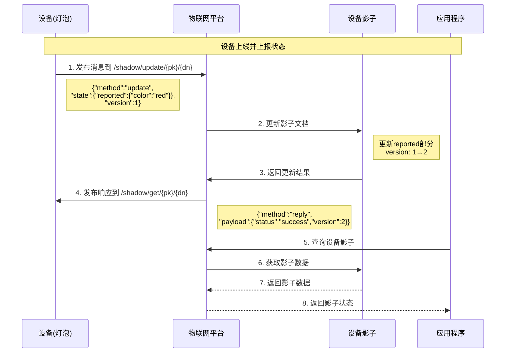
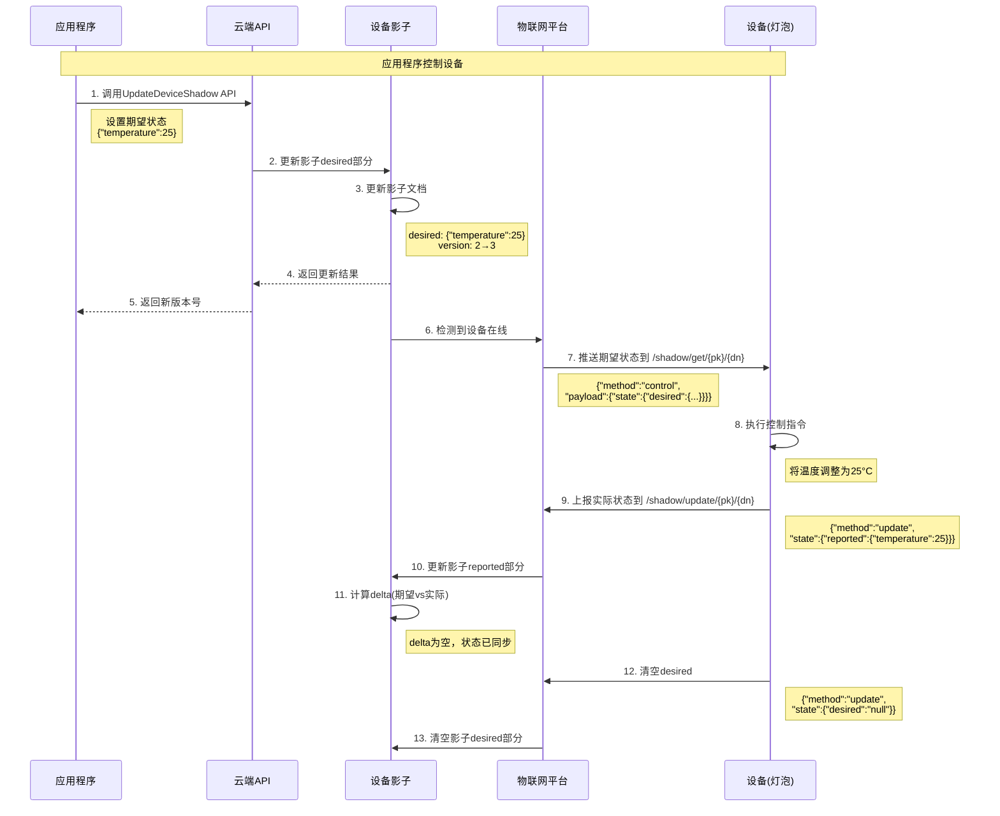
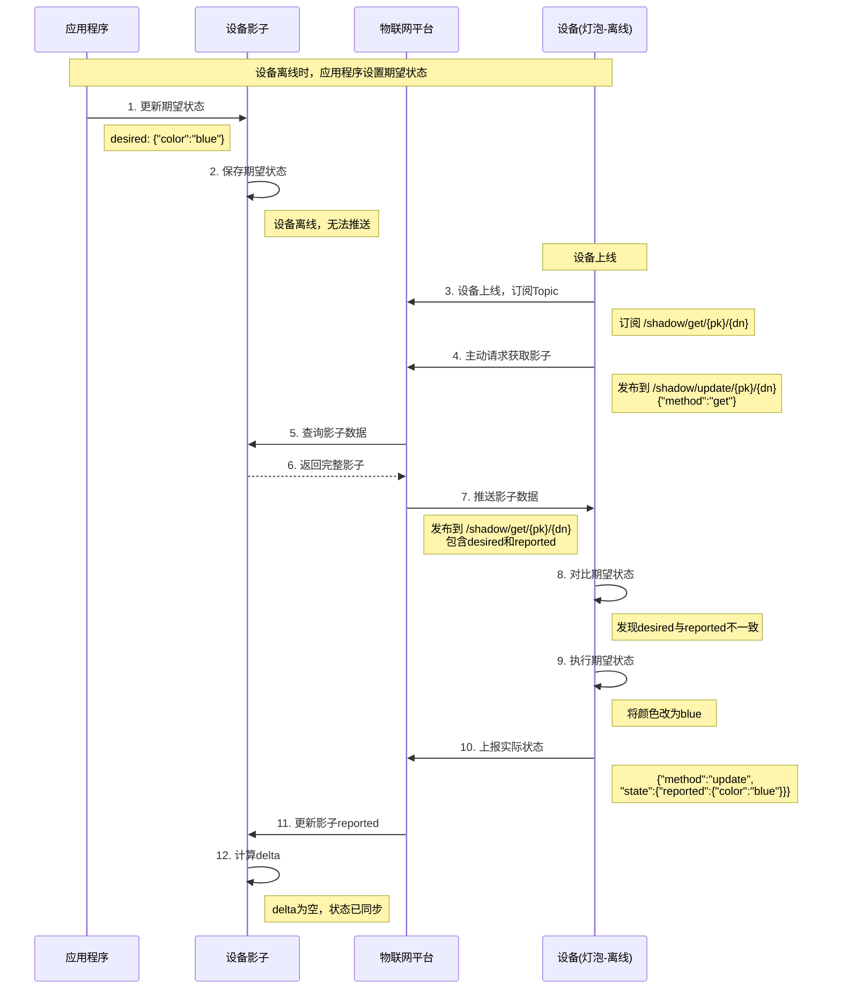
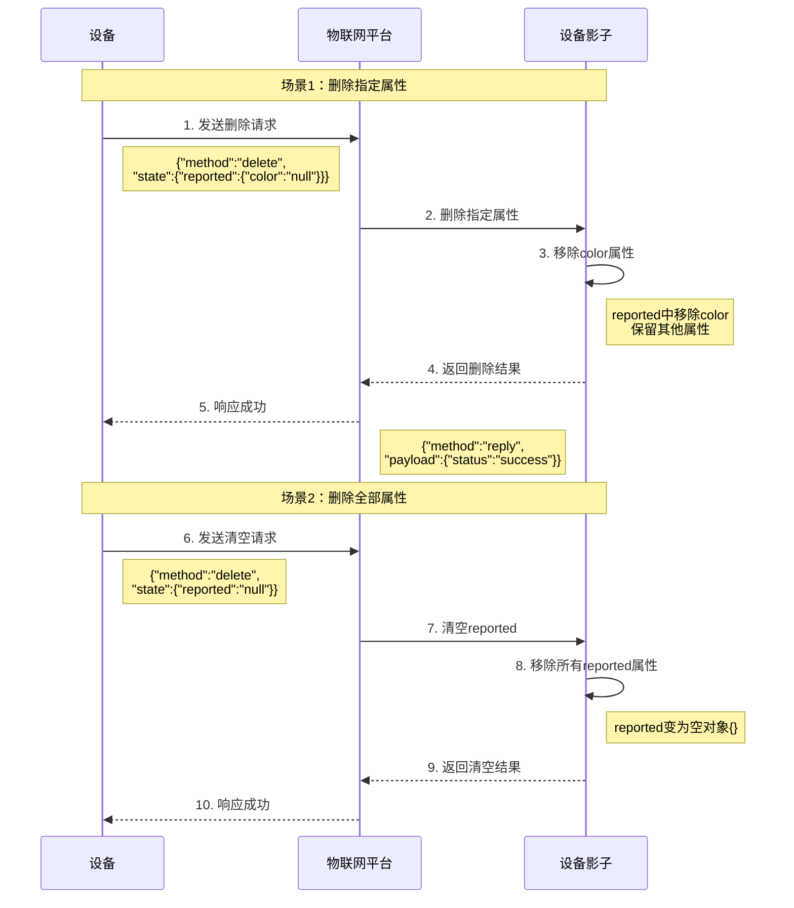

# 设备影子数据流转说明

## 概述

设备影子数据通过MQTT Topic进行流转，主要包括四个核心场景：
1. 设备主动上报状态到设备影子
2. 应用程序改变设备状态
3. 设备离线后上线主动获取设备影子信息
4. 设备主动请求删除设备影子中的属性信息

## 设备影子Topic

物联网平台为每个设备预定义了两个Topic，用于实现设备影子数据流转：

| Topic | 方向 | 说明 |
|-------|------|------|
| `/shadow/update/{productKey}/{deviceName}` | 设备→平台 | 设备和应用程序发布消息到此Topic，平台收到后更新设备影子 |
| `/shadow/get/{productKey}/{deviceName}` | 平台→设备 | 设备影子更新状态到该Topic，设备订阅此Topic获取最新消息 |

## 场景一：设备主动上报状态

### 业务场景

设备在线时，主动上报设备状态到影子，应用程序可以主动获取设备影子状态。

### 数据流转流程



### 详细步骤

**步骤1：设备上报状态**

设备发送消息到Topic：`/shadow/update/{productKey}/{deviceName}`

```json
{
  "method": "update",
  "state": {
    "reported": {
      "color": "red",
      "brightness": 80,
      "power": "on"
    }
  },
  "version": 1
}
```

**参数说明：**

| 参数 | 类型 | 必填 | 说明 |
|------|------|------|------|
| method | String | 是 | 操作类型，更新时为 `update` |
| state.reported | Object | 是 | 设备上报的实际状态 |
| version | Long | 是 | 当前版本号 |

**步骤2：平台更新影子**

设备影子接收到上报数据后，更新影子文档：

```json
{
  "state": {
    "reported": {
      "color": "red",
      "brightness": 80,
      "power": "on"
    }
  },
  "metadata": {
    "reported": {
      "color": {
        "timestamp": 1234567890
      },
      "brightness": {
        "timestamp": 1234567890
      },
      "power": {
        "timestamp": 1234567890
      }
    }
  },
  "version": 2,
  "timestamp": 1234567890
}
```

**步骤3：平台返回响应**

平台发送响应到Topic：`/shadow/get/{productKey}/{deviceName}`

成功响应：
```json
{
  "method": "reply",
  "payload": {
    "status": "success",
    "version": 2
  },
  "timestamp": 1234567891
}
```

失败响应：
```json
{
  "method": "reply",
  "payload": {
    "status": "error",
    "content": {
      "errorcode": "409",
      "errormessage": "版本冲突"
    }
  },
  "timestamp": 1234567891
}
```

### 错误码说明

| 错误码 | 说明 |
|--------|------|
| 400 | 不正确的JSON格式 |
| 401 | 影子数据缺少method信息 |
| 402 | 影子数据缺少state字段 |
| 403 | 影子数据中version值不是数字 |
| 404 | 影子数据缺少reported字段 |
| 405 | 影子数据中reported属性字段为空 |
| 406 | 影子数据中method是无效的方法 |
| 407 | 影子内容为空 |
| 408 | 影子数据中reported属性个数超过128个 |
| 409 | 影子版本冲突 |
| 500 | 服务端处理异常 |

## 场景二：应用程序改变设备状态

### 业务场景

应用程序通过调用云端API下发期望状态给设备影子，设备影子再将期望状态下发给设备端。设备根据影子更新状态，并上报最新状态至影子。

### 数据流转流程



### 详细步骤

**步骤1：应用程序下发期望状态**

调用API：`POST /eiot/device-shadow/update`

请求参数：
```http
POST /eiot/device-shadow/update?deviceId=1001&version=2
Content-Type: application/json

{
  "color": "green",
  "brightness": 100
}
```

**步骤2：平台更新影子**

设备影子更新文档：

```json
{
  "state": {
    "reported": {
      "color": "red",
      "brightness": 80
    },
    "desired": {
      "color": "green",
      "brightness": 100
    }
  },
  "metadata": {
    "reported": {
      "color": {
        "timestamp": 1234567890
      }
    },
    "desired": {
      "color": {
        "timestamp": 1234567900
      }
    }
  },
  "version": 3,
  "timestamp": 1234567900
}
```

**步骤3：平台推送期望状态**

如果设备在线，平台发送消息到Topic：`/shadow/get/{productKey}/{deviceName}`

```json
{
  "method": "control",
  "payload": {
    "state": {
      "reported": {
        "color": "red",
        "brightness": 80
      },
      "desired": {
        "color": "green",
        "brightness": 100
      }
    },
    "metadata": {
      "reported": {
        "color": {
          "timestamp": 1234567890
        }
      },
      "desired": {
        "color": {
          "timestamp": 1234567900
        }
      }
    }
  },
  "version": 3,
  "timestamp": 1234567900
}
```

**步骤4：设备执行并上报**

设备收到期望状态后，执行控制指令，然后上报实际状态：

```json
{
  "method": "update",
  "state": {
    "reported": {
      "color": "green",
      "brightness": 100
    }
  },
  "version": 3
}
```

**步骤5：设备清空期望状态**

设备状态同步完成后，清空desired：

```json
{
  "method": "update",
  "state": {
    "desired": "null"
  },
  "version": 4
}
```

最终影子文档：

```json
{
  "state": {
    "reported": {
      "color": "green",
      "brightness": 100
    }
  },
  "metadata": {
    "reported": {
      "color": {
        "timestamp": 1234567905
      }
    },
    "desired": {
      "timestamp": 1234567906
    }
  },
  "version": 5
}
```

## 场景三：设备主动获取影子内容

### 业务场景

当应用程序发送指令时设备离线，设备再次上线后，主动获取设备影子内容，同步期望状态。

### 数据流转流程



### 详细步骤

**步骤1：设备离线时应用程序设置期望**

影子保存期望状态：

```json
{
  "state": {
    "reported": {
      "color": "red"
    },
    "desired": {
      "color": "blue"
    }
  },
  "version": 5
}
```

**步骤2：设备上线后主动获取影子**

设备发送消息到Topic：`/shadow/update/{productKey}/{deviceName}`

```json
{
  "method": "get"
}
```

**步骤3：平台返回影子数据**

平台发送消息到Topic：`/shadow/get/{productKey}/{deviceName}`

```json
{
  "method": "reply",
  "payload": {
    "status": "success",
    "state": {
      "reported": {
        "color": "red",
        "brightness": 80
      },
      "desired": {
        "color": "blue"
      }
    },
    "metadata": {
      "reported": {
        "color": {
          "timestamp": 1234567890
        }
      },
      "desired": {
        "color": {
          "timestamp": 1234567920
        }
      }
    }
  },
  "version": 5,
  "timestamp": 1234567930
}
```

**步骤4：设备处理期望状态**

设备对比desired和reported，发现不一致，执行控制指令后上报：

```json
{
  "method": "update",
  "state": {
    "reported": {
      "color": "blue"
    }
  },
  "version": 5
}
```

## 场景四：设备主动删除影子属性

### 业务场景

若设备端已经是最新状态，设备端可以主动发送指令，删除设备影子中保存的某条或全部属性状态。

### 数据流转流程



### 详细步骤

#### 4.1 删除指定属性

**设备发送删除请求**

发送消息到Topic：`/shadow/update/{productKey}/{deviceName}`

```json
{
  "method": "delete",
  "state": {
    "reported": {
      "color": "null",
      "brightness": "null"
    }
  },
  "version": 6
}
```

**说明：**
- 将要删除的属性值设置为字符串 `"null"`
- 可以同时删除多个属性
- 未提及的属性保持不变

**删除前的影子：**

```json
{
  "state": {
    "reported": {
      "color": "blue",
      "brightness": 100,
      "power": "on"
    }
  },
  "version": 6
}
```

**删除后的影子：**

```json
{
  "state": {
    "reported": {
      "power": "on"
    }
  },
  "metadata": {
    "reported": {
      "power": {
        "timestamp": 1234567890
      }
    }
  },
  "version": 7,
  "timestamp": 1234567950
}
```

#### 4.2 删除全部属性

**设备发送清空请求**

发送消息到Topic：`/shadow/update/{productKey}/{deviceName}`

```json
{
  "method": "delete",
  "state": {
    "reported": "null"
  },
  "version": 7
}
```

**说明：**
- 将整个reported设置为字符串 `"null"`
- 清空所有reported属性

**清空后的影子：**

```json
{
  "state": {
    "reported": {}
  },
  "metadata": {
    "reported": {}
  },
  "version": 8,
  "timestamp": 1234567960
}
```

**平台响应：**

```json
{
  "method": "reply",
  "payload": {
    "status": "success",
    "version": 8
  },
  "timestamp": 1234567961
}
```

## 特殊操作：清空整个影子

### 使用场景

需要重置设备影子，清空所有desired和reported数据。

### 操作方法

设备发送特殊版本号 `-1`：

```json
{
  "method": "update",
  "version": -1
}
```

**说明：**
- `version: -1` 是特殊标识，表示清空整个影子
- 清空后版本号重置为 `0`
- desired和reported都会被清空

**清空后的影子：**

```json
{
  "state": {
    "reported": {},
    "desired": {}
  },
  "metadata": {
    "reported": {},
    "desired": {}
  },
  "version": 0,
  "timestamp": 1234567970
}
```

## 总结

设备影子通过MQTT Topic实现设备与云端的状态同步，支持四种核心场景：

1. **设备主动上报状态** - 设备实时上报当前状态到影子
2. **应用程序改变设备状态** - 云端下发期望状态，设备执行并反馈
3. **设备主动获取影子** - 设备上线后主动拉取最新状态
4. **设备主动删除属性** - 设备清理不需要的影子属性

通过合理使用这四种场景，可以实现可靠的设备状态管理和远程控制功能。
